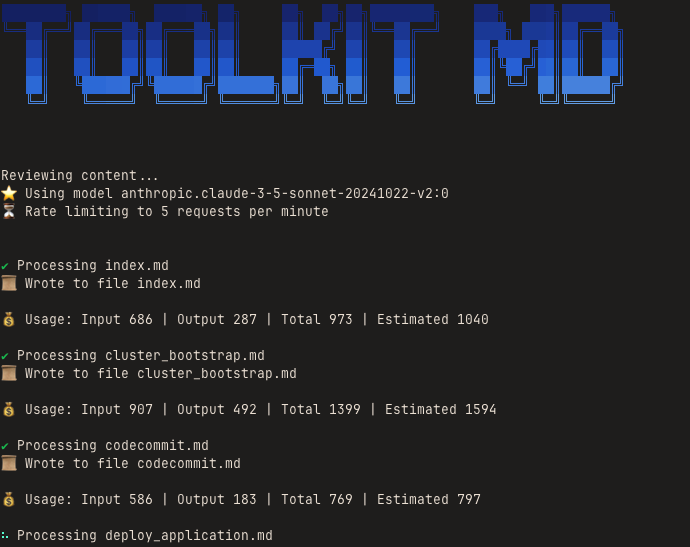

# Toolkit for Markdown

[](https://badge.fury.io/js/%40awslabs%2Ftoolkit-md)
[](https://opensource.org/licenses/Apache-2.0)

CLI tools for maintaining Markdown content like documentation and tutorials.



## Features

- **🤖 AI-Powered Content Review** - Automatically review and improve your Markdown content using Amazon Bedrock
- **🌍 Multi-Language Translation** - Translate content between 8+ supported languages
- **❓ Intelligent Q&A** - Ask questions about your content and get AI-powered answers
- **📝 Style Guide Enforcement** - Maintain consistency with custom style guides
- **⚡ Rate Limiting** - Built-in rate limiting for API calls
- **🎯 Context-Aware Processing** - Smart content processing with configurable context strategies
- **🔌 Model Context Protocol Server** - Integrate with tools like Cursor, Cline and Q Developer with the built-in MCP server

## Installation

```bash
npm install -g @aws/toolkit-md
# or
yarn global add @aws/toolkit-md
```

## Quick Start

### Review Content

Analyze and improve all Markdown files in a directory using AI:

```bash
toolkit-md review ./docs
```

Write the changes directly back to the source files:

```bash
toolkit-md review --write ./docs
```

Provide some additional instructions:

```bash
toolkit-md review --write ./docs --instructions 'Add more detailed explanations to the introduction page'
```

### Translate Content

Translate all Markdown content in a directory to French:

```bash
toolkit-md translate ./docs --to fr
```

### Ask Questions

Ask questions about content across an entire documentation directory:

```bash
toolkit-md ask ./docs --question "What are the main topics covered?"
```

## Configuration

Toolkit for Markdown supports configuration through:

1. Command line arguments
2. Environment variables
3. `.toolkit-mdrc` file

**Configuration Options:**

| Config Path              | CLI Flag             | Environment Variable          | Description                                                                                  | Default                                       |
| ------------------------ | -------------------- | ----------------------------- | -------------------------------------------------------------------------------------------- | --------------------------------------------- |
| `contentDir`             | `--content-dir`      | `TKMD_CONTENT_DIR`            | Directory relative to the cwd where content is hosted                                        | `undefined`                                   |
| `language`               | `--language`         | `TKMD_LANGUAGE`               | Source language code                                                                         | `"en"`                                        |
| `defaultLanguage`        | `--default-language` | `TKMD_DEFAULT_LANGUAGE`       | Language for files without explicit markers                                                  | `"en"`                                        |
| `ai.model`               | `--model`            | `TKMD_AI_MODEL`               | Amazon Bedrock model ID                                                                      | `"anthropic.claude-3-5-sonnet-20241022-v2:0"` |
| `ai.maxTokens`           | `--max-tokens`       | `TKMD_AI_MAX_TOKENS`          | Maximum output tokens                                                                        | `4096`                                        |
| `ai.write`               | `--write`            | `TKMD_AI_WRITE`               | Write changes directly to files                                                              | `false`                                       |
| `ai.rate.requests`       | `--request-rate`     | `TKMD_AI_REQUEST_RATE_LIMIT`  | Max requests per minute (0 = unlimited)                                                      | `0`                                           |
| `ai.rate.tokens`         | `--token-rate`       | `TKMD_AI_TOKEN_RATE_LIMIT`    | Max tokens per minute (0 = unlimited)                                                        | `0`                                           |
| `ai.contextStrategy`     | `--context-strategy` | `TKMD_AI_CONTEXT_STRATEGY`    | Context inclusion: "siblings", "nothing", "everything"                                       | `"nothing"`                                   |
| `ai.exemplars`           | `--exemplar`         | `TKMD_AI_EXEMPLAR_*`          | Path to directory of content to use as an example to follow, can be specified multiple times | `[]`                                          |
| `ai.styleGuides`         | `--style-guide`      | `TKMD_AI_STYLE_GUIDE_*`       | Path to style guide file, can be specified multiple times                                    | `[]`                                          |
| `ai.review.instructions` | `--instructions`     | `TKMD_AI_REVIEW_INSTRUCTIONS` | Additional instructions for the model                                                        | `undefined`                                   |
| `ai.review.summaryFile`  | `--summary-file`     | `TKMD_AI_REVIEW_SUMMARY_PATH` | Write a summary of the review changes to the provided file path in Markdown format           | `""`                                          |
| `ai.translation.force`   | `--force`            | `TKMD_AI_FORCE_TRANSLATION`   | Force translation even if source unchanged                                                   | `false`                                       |
| `ai.translation.check`   | `--check`            | `TKMD_AI_CHECK_TRANSLATION`   | Only check if translation needed                                                             | `false`                                       |

**Note:** For array values (exemplars, styleGuides), the environment variable referenced above is treated as a prefix: `TKMD_AI_EXEMPLAR_FIRST`, `TKMD_AI_EXEMPLAR_SECOND`, etc.

### Configuration File Format

Create a `.toolkit-mdrc` file in JSON format:

```json
{
  "baseDir": ".",
  "language": "en",
  "defaultLanguage": "en",
  "ai": {
    "model": "anthropic.claude-3-5-sonnet-20241022-v2:0",
    "maxTokens": 4096,
    "write": false,
    "rate": {
      "requests": 10,
      "tokens": 10000
    },
    "contextStrategy": "siblings",
    "exemplars": ["./examples/good-example1", "./examples/good-example2"],
    "styleGuides": ["./guides/style-guide.md", "./guides/aws-terminology.md"],
    "translation": {
      "force": false,
      "check": false
    }
  }
}
```

### Changing the working directory

Adding a `.toolkit-mdrc` file to a project is a useful way to set default configuration values for that project. The most effective way to make sure that the correct configuration file is picked up is to run `toolkit-md` from the directory of the project itself.

An alternative approach is to use the `--cwd` flag to change what the tool considers the current directory:

```bash
toolkit-md review --cwd ~/projects/my-project ./docs
```

This will:

1. Try to load a configuration file from `~/projects/my-project/.toolkit-mdrc`
2. Review the content in `~/projects/my-project/docs`

### Configuring a content directory

Its not unusual for Markdown content to be stored in a sub-directory of an overall project.

For example:

```
docs/.                      ← **Markdown documentation**
├── guide/
│   ├── getting-started.md
│   ├── installation.md
│   └── configuration.md
└── api/
    ├── authentication.md
    └── endpoints.md
src/                        ← **Other source code**
```

The `--content-dir` parameter can be used to information `toolkit-md` that a sub-directory is what it should consider the "root" for Markdown content.

```bash
toolkit-md review --content-dir ./docs ./guide
```

This will review the content in `./docs/guide`.

Taking this approach has several benefits:

1. It shortens the parameter used to target subsets of content for review
2. It allows `toolkit-md` to generate more succinct, targeted directory and file structure listings that can be provided to LLMs. Instead of mapping the entire project repository, it can focus on the specific directory that contains Markdown. This saves tokens and reduces the context sent to the model.

### Style Guides

Style guides are intended to help provide context on how content should ideally be written. This is usually expressed as natural language in Markdown format. The `--style-guide` parameter is used to provide a path to the style guide:

```text
--style-guide ./style-guide.md
```

Multiple `--style-guide` parameters can be provided to use different style guide files.

```text
--style-guide ./style-guide.md --style-guide ./other-style-guide.md
```

The paths can be either:

1. **Individual file:** A single Markdown file
2. **Directory:** A directory which will be recursively loaded using the same logic as the main content loader

#### Using with Translations

Style guides can be used to model language-specific content guidance that works effectively with the translation command. When using the `translate` command and a style guide directory is provided the style guides for both the source and target language will be loaded in to context.

For example you could create a directory called `i18n`:

```
docs/
[...]
i18n/
├── style-guide.fr.md
└── style-guide.es.md
style-guide.md
```

When running this command:

```bash
toolkit-md translate ./docs --to fr --style-guide style-guide.md --style-guide i18n
```

The style guides that are loaded would be:

- `style-guide.md`: It is explicitly provided
- `style-guide.fr.md`: It is discovered from the `i18n` directory based on the target language

### Context Strategy

The `contextStrategy` setting controls how much surrounding content is included when processing files. This affects the AI's understanding of the document structure and relationships.

**Strategy Options:**

#### `"nothing"` (default)

Processes each file in isolation with no additional context:

```
docs/
├── guide/
│   ├── getting-started.md
│   ├── installation.md      ← **processing this file only**
│   └── configuration.md
└── api/
    ├── authentication.md
    └── endpoints.md
```

#### `"siblings"`

Includes the current file and its sibling files in the same directory:

```
docs/
├── guide/
│   ├── getting-started.md   ← included as context
│   ├── installation.md      ← **processing this file**
│   └── configuration.md     ← included as context
└── api/
    ├── authentication.md
    └── endpoints.md
```

#### `"everything"`

Includes all files in the entire directory tree as context:

```
docs/
├── guide/
│   ├── getting-started.md   ← included as context
│   ├── installation.md      ← **processing this file**
│   └── configuration.md     ← included as context
└── api/
    ├── authentication.md    ← included as context
    └── endpoints.md         ← included as context
```

**Recommendation:** Use `"siblings"` for most cases as it provides good context while keeping token usage reasonable. Use `"everything"` for small documentation sets where full context is valuable, and `"nothing"` for independent files or when minimizing token usage.

### AWS Bedrock Setup

Toolkit for Markdown uses AWS Bedrock for AI processing. Ensure the following is available:

- AWS credentials configured
- Access to Bedrock models in the appropriate AWS account

## Commands

### `review`

Analyzes Markdown content using AI to identify areas for improvement including grammar, clarity, structure, and adherence to style guides. The AI reviews each file individually or with contextual awareness of related files, providing suggestions or directly applying changes. Supports processing entire directory trees of Markdown files while respecting language markers and file organization.

**Example:**

```bash
toolkit-md review ./docs --write --style-guide ./guides/style.md --context-strategy siblings
```

**Options:**

- `--write`
- `--language`
- `--default-language`
- `--model`
- `--max-tokens`
- `--content-dir`
- `--request-rate`
- `--token-rate`
- `--context-strategy`
- `--exemplar`
- `--style-guide`
- `--summary-file`
- `--instructions`

### `translate`

Translates Markdown content from one language to another while preserving formatting, frontmatter, and document structure. Includes intelligent change detection to avoid retranslating unchanged content and supports both checking for translation needs and forcing retranslation. Maintains translation metadata to track source content changes over time.

**Example:**

```bash
toolkit-md translate ./docs --to fr --write --exemplar ./examples/french-docs
```

**Options:**

- `--to` (required)
- `--write`
- `--language`
- `--default-language`
- `--model`
- `--max-tokens`
- `--content-dir`
- `--request-rate`
- `--token-rate`
- `--context-strategy`
- `--exemplar`
- `--style-guide`
- `--force`
- `--check`

### `ask`

Enables interactive querying of Markdown content using natural language questions. The AI analyzes the entire content tree to provide comprehensive answers about topics, structure, or specific information contained within the documentation. Useful for content discovery, summarization, and understanding complex documentation sets.

**Example:**

```bash
toolkit-md ask ./docs --question "What are the installation requirements and setup steps?"
```

**Options:**

- `--question` (required)
- `--language`
- `--default-language`
- `--model`
- `--max-tokens`
- `--content-dir`
- `--request-rate`
- `--token-rate`
- `--exemplar`
- `--style-guide`

### `mcp`

Starts an MCP server that exposes tool features to MCP clients. See below for further information.

**Example:**

```bash
toolkit-md mcp
```

**Options:**

- `--language`
- `--default-language`

## Model Context Protocol server

The built-in MCP server allows tools like Cursor, Cline and Q Developer to integrate and leverage the same Markdown file discovery, parsing and style guides as running the CLI commands. This is useful when working in an IDE to write new content or review existing content using agentic AI tools.

Some example prompts:

"Review the markdown content in this project for issues and best practices"

"Translate the markdown content section on Amazon DynamoDB to French"

Here is an example of configuring the MCP server in Q Developer:

```json
{
  "mcpServers": {
    "toolkit-md": {
      "command": "toolkit-md",
      "timeout": 10000,
      "args": ["mcp"]
    }
  }
}
```

Alternatively you can use `npx`:

```json
{
  "mcpServers": {
    "toolkit-md": {
      "command": "npx",
      "timeout": 10000,
      "args": ["@aws/toolkit-md", "mcp"]
    }
  }
}
```

For safety purposes the MCP server will refuse to load files from outside the current working directory that the MCP is running in. You can override the current working directory using the `--cwd` flag to broaden the files accessible.

The following MCP tools are provided:

| Tools                          | Description                                                                                                                                                                                                        |
| ------------------------------ | ------------------------------------------------------------------------------------------------------------------------------------------------------------------------------------------------------------------ |
| `content_summary_information`  | Response provides high level information for the model to locate Markdown content in a given project for orientation.                                                                                              |
| `content_best_practices`       | Response contains style guide and exemplar content as configured for the specified project. It the `targetLanguage` is provided it will also load style guides for that language and provide them in the response. |
| `content_review_guidance`      | Response contains guidance for the model to systematically review Markdown content for a given project for general issues and best practices.                                                                      |
| `content_translation_guidance` | Response contains guidance for the model to translate Markdown for a given project to another language. It helps the model locate both source content as well as existing translated content to use for context.   |

## Development

```bash
# Install dependencies
yarn install

# Build the project
yarn build

# Run tests
yarn test

# Execute the tool
yarn start review ./docs
```

## License

This project is licensed under the Apache License 2.0 - see the [LICENSE](LICENSE) file for details.

## Contributing

Contributions are welcome! Please feel free to submit a Pull Request.
